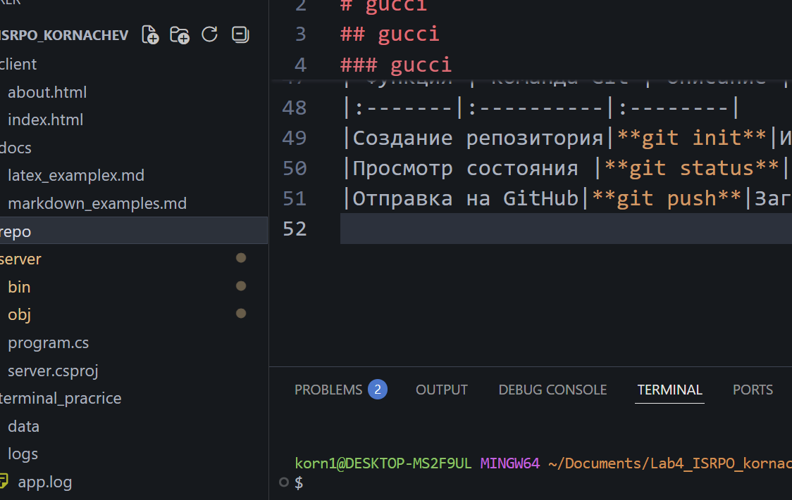

1. Заголовки всех уровней H1–H6
# gucci
## gucci 
### gucci
#### gucci 
##### gucci
###### gucci
2. Горизонтальные линии
***
---
___
3. Форматирование текста
- **жирный**
- *курсив*
- ~~зачеркнутый~~
- моноширный(??не понял)
4. Списки
маркированные:
- 1
- 2
- 3
Нумерованные:
1. Первый пункт
2. Второй пункт
3. Третий пункт
Вложенные:
1. Пункт
- *
- -
- +
5. Цитаты
>Markdown — это лёгкий язык разметки, который используется для оформления документации, README-файлов и отчётов.
6. блок кода
```csharp
using System;

class Program
{
    static void Main()
    {
        Console.WriteLine("Hello, Markdown!");
    }
}
```
7. Таблица

| Функция | Команда Git | Описание |
|:-------|:----------|:--------|
|Создание репозитория|**git init**|Инициализация репозитория|
|Просмотр состояния |**git status**|Показывает изменённые файлы|
|Отправка на GitHub|**git push**|Загружает коммиты на сервер|
8. Картинка из папки repo/

9. Ссылки
[Внешняя ссылка](https://github.com/K123456-alt/Lab4_ISPRO_kornachev)
[Внутрення ссылка](#https://github.com/K123456-alt/Lab4_ISPRO_kornachev)
10. Чекбоксы
- [x] Выполнено
- [ ] Не выполнено
11. Alert-блоки
>[!NOTE]
Заметка

> [!TIP]
совет

> [!IMPORTANT]
важная информация

> [!WARNING]
предупреждение!

> [!CAUTION]
осторожно!

12. Inline LaTeX
$a^2 + b^2 = c^2$
$x^2, a_i, x^{10}$
$\frac{a}{b}$
$\sqrt{x}, \sqrt[3]{y}$
$\sum_{i=1}^n i$
$\prod_{k=1}^n k$
13. Block LaTeX
$$
\sum_{i=1}^n i = \frac{n(n+1)}{2}
$$
$$
\int_0^\infty e^{-x^2} dx = \frac{\sqrt{\pi}}{2}
$$


